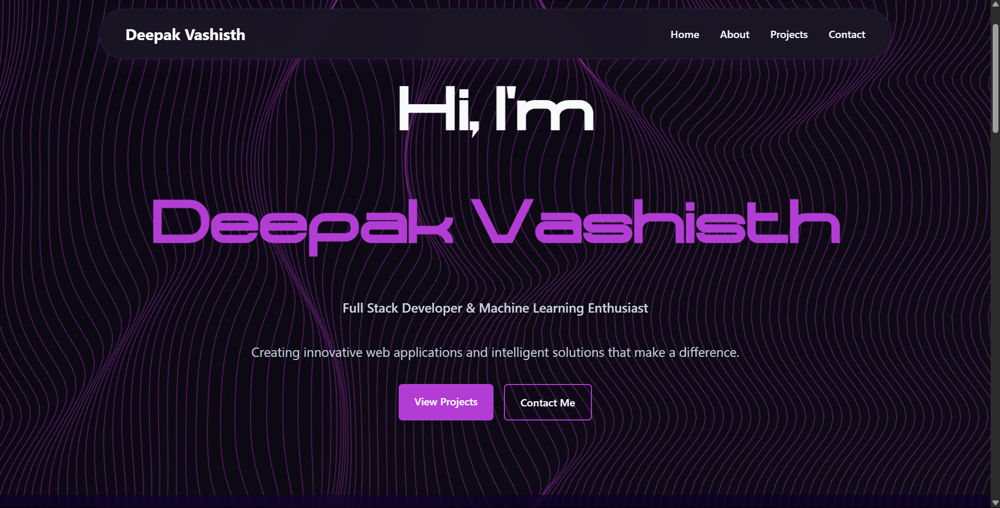

# 🌟 Deepak Vashisth's Portfolio

> A modern, interactive portfolio showcasing my journey as a Full Stack Developer & Machine Learning Enthusiast



## ✨ Features

- 🎨 **Modern Dark Theme** - Elegant dark purple aesthetic with glassmorphism effects
- 🌊 **Interactive Wave Background** - Dynamic animated waves responding to mouse movement
- 🔤 **Custom Typography** - Unique `Starixo` font for striking visual impact
- 📱 **Fully Responsive** - Seamless experience across all devices
- ⚡ **Smooth Animations** - Blur text reveals and hover effects
- 🎥 **Video Background** - Cinematic hero section with video backdrop
- 💫 **Glassmorphism UI** - Modern translucent design elements

## 🚀 Live Demo

Experience the portfolio live: **[Deepak-Vashisth/PortFolio](https://portfolio-0e1t.onrender.com/)**

## 🛠️ Technologies Used

| Category | Technologies |
|----------|-------------|
| **Frontend** | HTML5, CSS3 (Modern Features) |
| **JavaScript** | Vanilla JS, Custom Animation Engines |
| **Typography** | Custom Starixo Font, Web Font Loading |
| **Media** | Background Videos, Optimized Images |
| **Design** | Glassmorphism, Dark Theme, Purple Palette |

## 📂 Project Structure

```
Portfolio/
├── 📄 index.html              # Main HTML structure
├── 🎨 styles.css              # Enhanced styling with animations
├── ⚡ script.js               # Core functionality
├── 🌊 background-vanilla.js   # Wave animation system
├── ✨ blurtext-vanilla.js     # Text reveal animations
├── 🎥 background.mp4          # Hero video background
├── 🔤 Starixo-Font/           # Custom font files
│   ├── Starixo.otf
│   └── Starixo.ttf
└── 🖼️ Assets/                 # Project images and media
```

## 🎯 Portfolio Sections

### 🏠 Hero Section
- Dynamic video background
- Animated name reveal with custom Starixo font
- Interactive wave animations
- Call-to-action buttons

### 👨‍💻 About Me
- Professional summary
- Animated skill progress bars
- Technology expertise showcase
- Modern glassmorphism cards

### 💼 Projects
- Interactive project cards
- Technology tags for each project
- Hover effects and smooth transitions
- Live demo and source code links

### 📧 Contact
- Modern contact form
- Social media integration
- Professional contact information
- Interactive elements

## 🎨 Design Philosophy

This portfolio embodies modern web design principles:
- **User Experience First** - Intuitive navigation and smooth interactions
- **Visual Hierarchy** - Clear content structure with engaging animations
- **Performance Optimized** - Efficient loading with progressive enhancement
- **Accessibility Minded** - Semantic HTML and keyboard navigation support

## 🚀 Getting Started

### Prerequisites
- Modern web browser (Chrome, Firefox, Safari, Edge)
- Git (for cloning)

### Installation

1. **Clone the repository**
   ```bash
   git clone https://github.com/Deepak-vash23/PortFolio.git
   ```

2. **Navigate to project directory**
   ```bash
   cd PortFolio
   ```

3. **Open in browser**
   ```bash
   # Simply open index.html in your browser
   # Or use a local server for best experience
   ```

### Local Development
For the best development experience, use a local server:
- **VS Code**: Use Live Server extension
- **Python**: `python -m http.server 8000`
- **Node.js**: `npx serve .`

## 🌟 Key Highlights

- **Custom Animation Engine** - Hand-crafted wave animations without external libraries
- **Performance Optimized** - Vanilla JavaScript for minimal bundle size
- **Modern CSS** - Utilizing latest CSS features like backdrop-filter and custom properties
- **Font Loading Strategy** - Optimized custom font loading with fallbacks
- **Responsive Design** - Mobile-first approach with fluid layouts

## 📈 Performance

- ⚡ Fast loading times with optimized assets
- 🎯 Lighthouse score optimized
- 📱 Mobile-first responsive design
- 🔄 Progressive enhancement approach

## 🤝 Connect With Me

- 🌐 **Portfolio**: [Live Demo](https://portfolio-0e1t.onrender.com/)
- 💼 **LinkedIn**: [Deepak Vashisth](https://www.linkedin.com/in/deepak-vashisth)
- 🐱 **GitHub**: [Deepak-vash23](https://github.com/Deepak-vash23)
- 📧 **Email**: Available via contact form

## 📄 License

This project is open source and available under the [MIT License](LICENSE).

---

<div align="center">
  <p><strong>Built with 💜 by Deepak Vashisth</strong></p>
  <p><em>Crafting digital experiences with modern web technologies</em></p>
</div>
